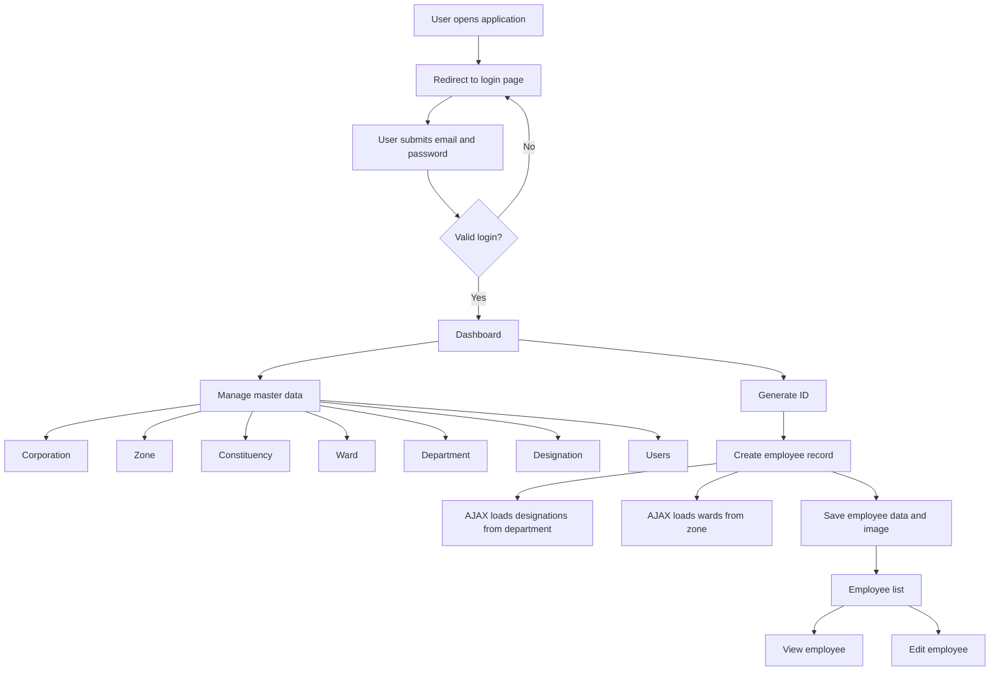
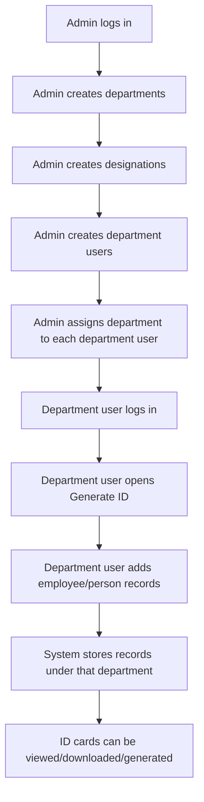
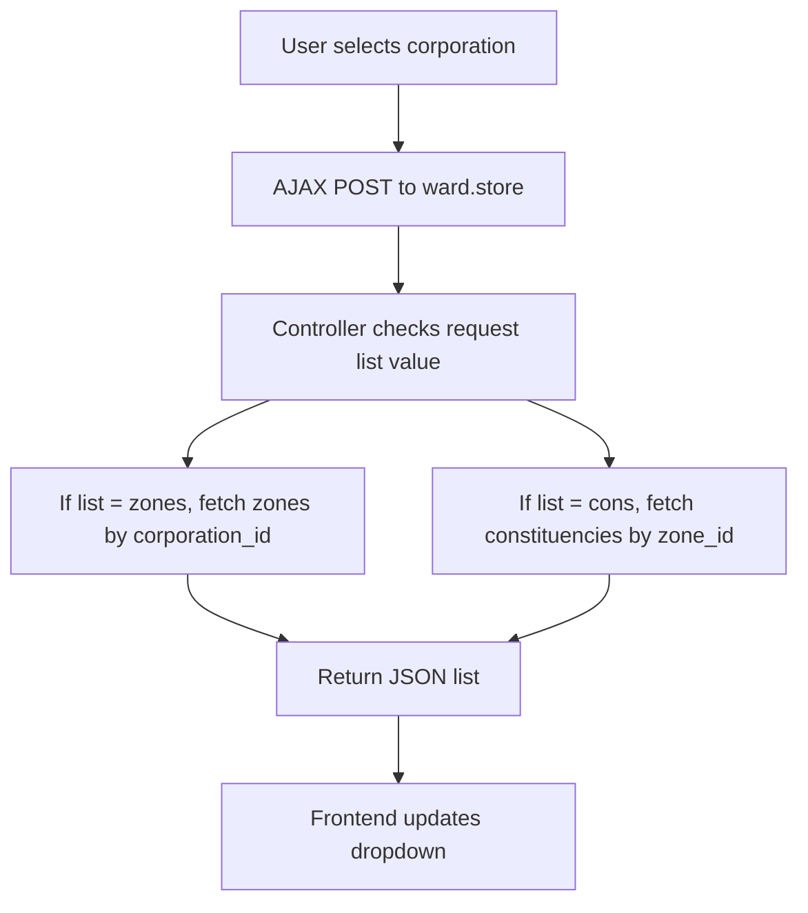
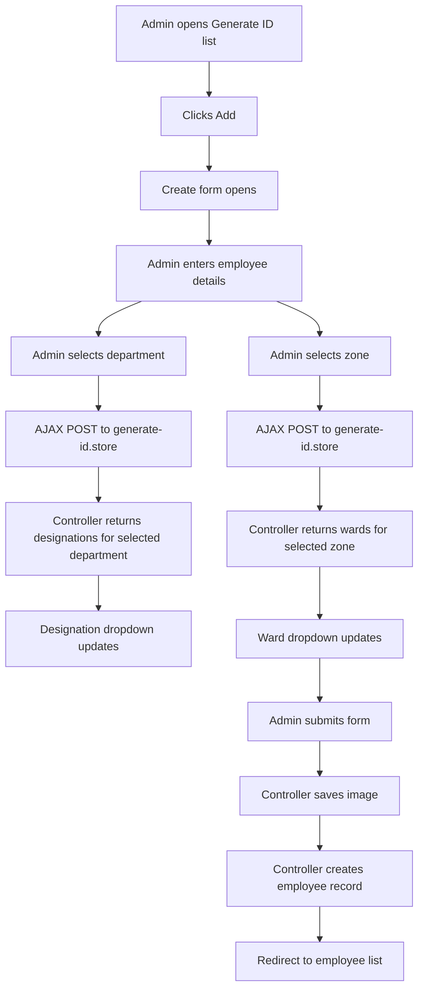
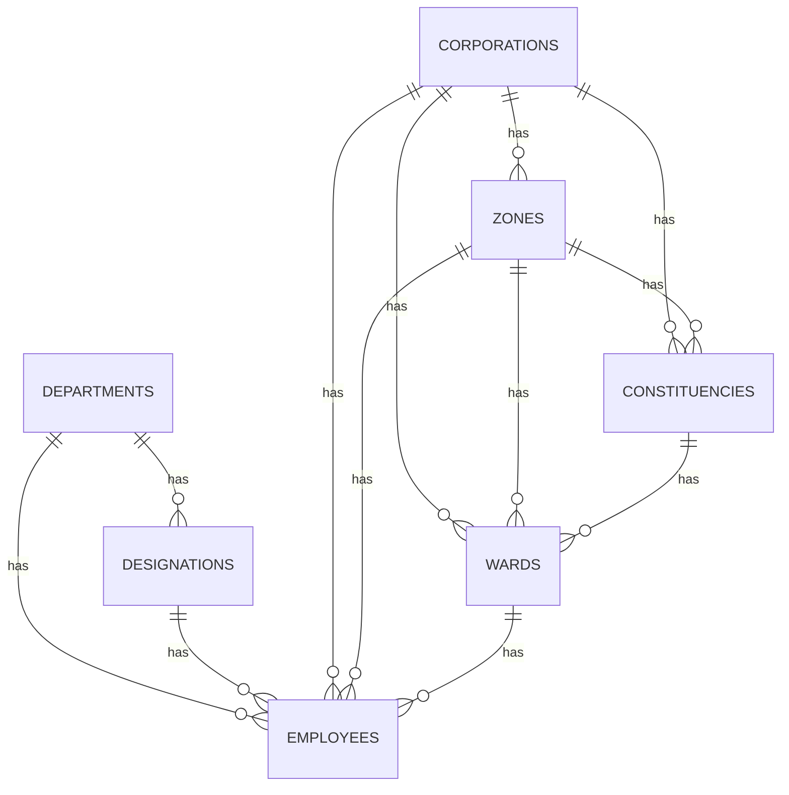

# Generate ID Project Documentation

## 1. Project Overview

This project is a Laravel 12 web application used to manage master data and generate employee ID records.

The application is currently built as a traditional Laravel Blade admin panel. It uses:

- Laravel controllers for request handling.
- Eloquent models for database access.
- Blade files for pages.
- jQuery AJAX for dependent dropdowns.
- Bootstrap/admin theme assets for UI.
- Laravel authentication from `laravel/ui`.

The main purpose of the system is:

1. Admin logs in.
2. Admin manages master data such as corporation, zones, wards, departments, and designations.
3. Admin creates employee ID records.
4. Admin can view and edit generated employee records.

At present, this is not a complete API-based application. It has a few AJAX responses, but most work is handled by web routes and Blade pages.

## 2. Folder Structure

Important folders:

| Folder | Purpose |
| --- | --- |
| `app/Http/Controllers` | Contains controller classes. Controllers receive requests and return views, redirects, or JSON. |
| `app/Models` | Contains Eloquent models for database tables. |
| `database/migrations` | Defines database table structure. |
| `database/seeders` | Creates default seed data such as admin user. |
| `resources/views` | Contains Blade templates for login, dashboard, and admin pages. |
| `routes/web.php` | Defines browser routes for the application. |
| `public/theme` | Contains CSS, JavaScript, image, and font assets for the admin theme. |
| `tests` | Contains default Laravel test files. |

## 3. Main Route Flow

Routes are defined in `routes/web.php`.

### Public Routes

| Route | Name | Purpose |
| --- | --- | --- |
| `GET /` | none | Redirects user to login page. |
| Auth routes | login, logout, register, password routes | Created by `Auth::routes()`. |
| `GET /clear-cache` | none | Clears Laravel cache, route cache, config cache, and view cache. This should not be public in production. |
| `GET /genarateedit` | `genarateedit` | Opens static generate edit page. This route is not part of normal resource flow. |
| `GET /genarateshow` | `genarateshow` | Opens static generate show page. This route is not part of normal resource flow. |
| `GET /bulkdownload` | `bulkdownload` | Opens bulk download view. |
| `GET /forgot` | `forgot` | Opens forgot password view. |

### Authenticated Routes

These routes are inside the `auth` middleware group, so only logged-in users can access them.

| Route Group | Controller | Purpose |
| --- | --- | --- |
| `/dashboard` | `HomeController@index` | Shows admin dashboard. |
| `/corporation` | `CorporationController` | CRUD for corporations. |
| `/zone` | `ZoneController` | CRUD for zones. |
| `/constituency` | `ConstituencyController` | CRUD for constituencies. |
| `/ward` | `WardController` | CRUD for wards. |
| `/user` | `UserController` | CRUD for admin users. |
| `/department` | `DepartmentController` | CRUD for departments. |
| `/designation` | `DesignationController` | CRUD for designations. |
| `/generate-id` | `EmployeeController` | CRUD for employee ID records. |

## 4. Overall Working Flow



## 4.1 Intended Role-Based Working Flow

Based on the required workflow, the system should work with two main user types:

| User Type | Responsibility |
| --- | --- |
| Admin | Creates departments, designations, master data, and department users. |
| Department User | Logs in and adds a list of people/employees for generating ID cards. |

Expected flow:



### Current Code Status For This Workflow

The current code has partial support for this idea:

| Feature | Current Status |
| --- | --- |
| Admin user | Exists through `role = 1`. |
| Department user | Partially exists through `role = 2`. |
| Admin can create users | Yes, through `UserController`. |
| User can have department IDs | Partially, through `department_ids` field. |
| Department user can add Generate ID records | Technically yes if they can access the route. |
| Department user restricted to own department | Not implemented. |
| Department user list filtered by own department | Not implemented. |
| Role-based sidebar/menu permissions | Not implemented. |
| Admin-only master pages | Not enforced in controller/policy level. |

### Required Logic To Fully Support This Workflow

To correctly support "admin creates department users, and department users add users for ID cards", the application should add role and permission checks.

Recommended behavior:

1. Admin can access all modules:
   - Dashboard
   - Corporation
   - Zone
   - Constituency
   - Ward
   - Department
   - Designation
   - Users
   - Generate ID

2. Department user should access only:
   - Dashboard
   - Generate ID list
   - Generate ID create
   - Generate ID edit/show for records created by them or assigned to their department

3. Department user should not access:
   - Corporation management
   - Zone management
   - Constituency management
   - Ward management
   - Department management
   - Designation management
   - User management

4. When department user creates an ID record:
   - `department_id` should come from the logged-in user's assigned department.
   - User should not be allowed to submit another department ID manually.
   - Employee records should store `created_by` user ID.

5. Generate ID list should be filtered:
   - Admin sees all employee records.
   - Department user sees only records from their department or records created by them.

Recommended employee table additions:

| Field | Purpose |
| --- | --- |
| `created_by` | Stores which user created the employee/ID record. |
| `address` | Stores address shown in Generate ID form. |
| `blood_group` | Stores blood group shown in Generate ID form. |
| `valid_upto` | Stores ID card validity date. |

Recommended authorization structure:

```text
app/Http/Middleware/AdminOnly.php
app/Http/Middleware/DepartmentUserOnly.php
app/Policies/EmployeePolicy.php
```

Recommended route grouping:

```php
Route::middleware(['auth'])->group(function () {
    Route::get('/dashboard', [HomeController::class, 'index'])->name('dashboard');

    Route::resource('generate-id', EmployeeController::class);

    Route::middleware(['admin'])->group(function () {
        Route::resource('corporation', CorporationController::class);
        Route::resource('zone', ZoneController::class);
        Route::resource('constituency', ConstituencyController::class);
        Route::resource('ward', WardController::class);
        Route::resource('user', UserController::class);
        Route::resource('department', DepartmentController::class);
        Route::resource('designation', DesignationController::class);
    });
});
```

This keeps the Generate ID feature available for both admin and department users, while master data and user creation stay admin-only.

## 5. Authentication Flow

### Login Page

View:

- `resources/views/auth/login.blade.php`

Controller:

- `app/Http/Controllers/Auth/LoginController.php`

Important logic:

- Uses Laravel's `AuthenticatesUsers` trait.
- After successful login, user is redirected to `/dashboard`.
- Login requires email and password.
- Frontend JavaScript checks that email and password are not empty.
- Laravel performs actual authentication on the backend.

### LoginController Functions

| Function | Purpose |
| --- | --- |
| `__construct()` | Applies middleware. Guests can access login. Authenticated users can logout. |

Important property:

| Property | Purpose |
| --- | --- |
| `$redirectTo = '/dashboard'` | Redirects user to dashboard after login. |

## 6. Dashboard Flow

Controller:

- `app/Http/Controllers/HomeController.php`

View:

- `resources/views/admin/dashboard.blade.php`

### HomeController Functions

| Function | Purpose |
| --- | --- |
| `__construct()` | Currently does not apply middleware because middleware line is commented. Route group already protects dashboard with `auth`. |
| `index()` | Returns `admin.dashboard` view. |

## 7. Corporation Module

Model:

- `app/Models/Corporation.php`

Views:

- `resources/views/admin/corporation/index.blade.php`
- `resources/views/admin/corporation/create.blade.php`
- `resources/views/admin/corporation/edit.blade.php`
- `resources/views/admin/corporation/show.blade.php`

Database table:

- `corporations`

Fields:

| Field | Purpose |
| --- | --- |
| `id` | Primary key. |
| `name` | Corporation name. |
| `name_kn` | Kannada corporation name. |
| `status` | Active or inactive flag. |
| `created_at`, `updated_at` | Laravel timestamps. |

### CorporationController Functions

| Function | Working |
| --- | --- |
| `index()` | Fetches all corporations and opens corporation list page. |
| `create()` | Opens create corporation form. |
| `store(Request $request)` | Saves new corporation using request data, flashes success message, redirects to corporation list. |
| `show(Corporation $corporation)` | Opens corporation detail page for selected corporation. |
| `edit(Corporation $corporation)` | Opens edit form for selected corporation. |
| `update(Request $request, Corporation $corporation)` | Updates selected corporation, flashes success message, redirects to list. |
| `destroy(Corporation $corporation)` | Currently empty. Delete is not implemented. |

## 8. Zone Module

Model:

- `app/Models/Zone.php`

Views:

- `resources/views/admin/zone/index.blade.php`
- `resources/views/admin/zone/create.blade.php`
- `resources/views/admin/zone/edit.blade.php`
- `resources/views/admin/zone/show.blade.php`

Database table:

- `zones`

Fields:

| Field | Purpose |
| --- | --- |
| `id` | Primary key. |
| `corporation_id` | Corporation linked to this zone. |
| `name` | Zone name. |
| `name_kn` | Kannada zone name. |
| `status` | Active or inactive flag. |
| `created_at`, `updated_at` | Laravel timestamps. |

### Model Relationship

| Function | Relationship |
| --- | --- |
| `corporation()` | A zone belongs to one corporation. |

### ZoneController Functions

| Function | Working |
| --- | --- |
| `index()` | Fetches zones with corporation data and opens zone list page. |
| `create()` | Fetches corporations and opens create zone form. |
| `store(Request $request)` | Saves new zone, flashes success message, redirects to zone list. |
| `show(Zone $zone)` | Opens zone detail page. |
| `edit(Zone $zone)` | Fetches corporations and opens edit zone form. |
| `update(Request $request, Zone $zone)` | Updates selected zone and redirects to list. |
| `destroy(Zone $zone)` | Currently empty. Delete is not implemented. |

## 9. Constituency Module

Model:

- `app/Models/Constituency.php`

Views:

- `resources/views/admin/constituency/index.blade.php`
- `resources/views/admin/constituency/create.blade.php`
- `resources/views/admin/constituency/edit.blade.php`
- `resources/views/admin/constituency/show.blade.php`

Database table:

- `constituencies`

Fields:

| Field | Purpose |
| --- | --- |
| `id` | Primary key. |
| `corporation_id` | Corporation linked to this constituency. |
| `zone_id` | Zone linked to this constituency. |
| `name` | Constituency name. |
| `name_kn` | Kannada constituency name. |
| `status` | Active or inactive flag. |
| `created_at`, `updated_at` | Laravel timestamps. |

### Model Relationships

| Function | Relationship |
| --- | --- |
| `corporation()` | A constituency belongs to one corporation. |
| `zone()` | A constituency belongs to one zone. |

### ConstituencyController Functions

| Function | Working |
| --- | --- |
| `index()` | Fetches constituencies with corporation and zone data, then opens list page. |
| `create()` | Fetches corporations and zones, then opens create form. |
| `store(Request $request)` | Saves new constituency and redirects to list. |
| `show(Constituency $constituency)` | Currently empty. Show page is not implemented in controller. |
| `edit(Constituency $constituency)` | Fetches corporations and zones for selected corporation, then opens edit form. |
| `update(Request $request, Constituency $constituency)` | Updates selected constituency and redirects to list. |
| `destroy(Constituency $constituency)` | Currently empty. Delete is not implemented. |

## 10. Ward Module

Model:

- `app/Models/Ward.php`

Views:

- `resources/views/admin/ward/index.blade.php`
- `resources/views/admin/ward/create.blade.php`
- `resources/views/admin/ward/edit.blade.php`
- `resources/views/admin/ward/show.blade.php`

Database table:

- `wards`

Fields:

| Field | Purpose |
| --- | --- |
| `id` | Primary key. |
| `corporation_id` | Corporation linked to this ward. |
| `zone_id` | Zone linked to this ward. |
| `constituency_id` | Constituency linked to this ward. |
| `name` | Ward name. |
| `name_kn` | Kannada ward name. |
| `number` | Ward number. |
| `status` | Active or inactive flag. |
| `created_at`, `updated_at` | Laravel timestamps. |

### Model Relationships

| Function | Relationship |
| --- | --- |
| `corporation()` | A ward belongs to one corporation. |
| `zone()` | A ward belongs to one zone. |
| `constituency()` | A ward belongs to one constituency. |

### WardController Functions

| Function | Working |
| --- | --- |
| `index()` | Fetches wards with corporation, zone, and constituency data, then opens ward list. |
| `create()` | Fetches corporations, zones, and constituencies, then opens create ward form. |
| `store(Request $request)` | Has two behaviors. If request is AJAX, returns filtered zones or constituencies as JSON. Otherwise saves new ward and redirects to list. |
| `show(Ward $ward)` | Opens ward detail page. |
| `edit(Ward $ward)` | Fetches corporations, zones, constituencies, then opens edit ward form. |
| `update(Request $request, Ward $ward)` | Updates selected ward and redirects to list. |
| `destroy(Ward $ward)` | Currently empty. Delete is not implemented. |

### Ward AJAX Flow

The `store()` method is also used for dependent dropdown AJAX:



## 11. Department Module

Model:

- `app/Models/Department.php`

Views:

- `resources/views/admin/department/index.blade.php`
- `resources/views/admin/department/create.blade.php`
- `resources/views/admin/department/edit.blade.php`
- `resources/views/admin/department/show.blade.php`

Database table:

- `departments`

Fields:

| Field | Purpose |
| --- | --- |
| `id` | Primary key. |
| `name` | Department name. |
| `status` | Active or inactive flag. |
| `created_at`, `updated_at` | Laravel timestamps. |

### DepartmentController Functions

| Function | Working |
| --- | --- |
| `index()` | Fetches all departments and opens department list. |
| `create()` | Opens create department form. |
| `store(Request $request)` | Saves new department name and redirects to list. |
| `show(Department $department)` | Opens department detail page. |
| `edit(Department $department)` | Opens edit department form. |
| `update(Request $request, Department $department)` | Updates department name and status, then redirects to list. |
| `destroy(Department $department)` | Currently empty. Delete is not implemented. |

## 12. Designation Module

Model:

- `app/Models/Designation.php`

Views:

- `resources/views/admin/designation/index.blade.php`
- `resources/views/admin/designation/create.blade.php`
- `resources/views/admin/designation/edit.blade.php`
- `resources/views/admin/designation/show.blade.php`

Database table:

- `designations`

Fields:

| Field | Purpose |
| --- | --- |
| `id` | Primary key. |
| `department_id` | Department linked to this designation. |
| `name` | Designation name. |
| `status` | Active or inactive flag. |
| `created_at`, `updated_at` | Laravel timestamps. |

### DesignationController Functions

| Function | Working |
| --- | --- |
| `index()` | Fetches all designations and opens designation list. |
| `create()` | Fetches active departments and opens create designation form. |
| `store(Request $request)` | Saves new designation with department ID and redirects to list. |
| `show(Designation $designation)` | Opens designation detail page. |
| `edit(Designation $designation)` | Fetches active departments and opens edit designation form. |
| `update(Request $request, Designation $designation)` | Updates department ID, name, and status, then redirects to list. |
| `destroy(Designation $designation)` | Currently empty. Delete is not implemented. |

## 13. User Module

Model:

- `app/Models/User.php`

Views:

- `resources/views/admin/user/index.blade.php`
- `resources/views/admin/user/create.blade.php`
- `resources/views/admin/user/edit.blade.php`
- `resources/views/admin/user/show.blade.php`

Database table:

- `users`

Fields:

| Field | Purpose |
| --- | --- |
| `id` | Primary key. |
| `name` | User name. |
| `email` | Login email. |
| `password` | Hashed password. |
| `role` | User role. `1` is admin, `2` is normal user. |
| `phone` | User phone number. |
| `ward_ids` | Comma-separated ward IDs. |
| `department_ids` | Comma-separated department IDs. |
| `status` | Active or inactive flag. |
| `remember_token` | Laravel remember me token. |
| `created_at`, `updated_at` | Laravel timestamps. |

### UserController Functions

| Function | Working |
| --- | --- |
| `index()` | Fetches users whose role is not `1`, then opens user list. |
| `create()` | Fetches wards and active departments, then opens create user form. |
| `store(Request $request)` | Saves user, hashes password, sets role to `2`, then redirects to list. |
| `show(User $user)` | Opens user detail page. |
| `edit(User $user)` | Fetches wards and opens edit user form. |
| `update(Request $request, User $user)` | Updates user data, hashes password if provided, sets role to `2`, then redirects to list. |
| `destroy(User $user)` | Currently empty. Delete is not implemented. |

### User Model Accessor Functions

| Function | Working |
| --- | --- |
| `getWardNamesAttribute()` | Converts comma-separated `ward_ids` into ward names. |
| `getWardsAttribute()` | Converts comma-separated `ward_ids` into an array. |
| `getDepartmentNamesAttribute()` | Converts comma-separated `department_ids` into department names. |
| `getDepartmentsAttribute()` | Converts comma-separated `department_ids` into an array. |

## 14. Generate ID / Employee Module

Controller:

- `app/Http/Controllers/EmployeeController.php`

Model:

- `app/Models/Employee.php`

Views:

- `resources/views/admin/generate/index.blade.php`
- `resources/views/admin/generate/create.blade.php`
- `resources/views/admin/generate/edit.blade.php`
- `resources/views/admin/generate/show.blade.php`
- `resources/views/admin/generate/bulkdownload.blade.php`

Database table:

- `employees`

Fields currently stored:

| Field | Purpose |
| --- | --- |
| `id` | Primary key. |
| `name` | Employee name. |
| `emp_id` | Employee ID. |
| `department_id` | Linked department. |
| `designation_id` | Linked designation. |
| `phone` | Phone number. |
| `image` | Uploaded image path. |
| `corporation_id` | Linked corporation. Currently hardcoded as `5` in controller. |
| `zone_id` | Linked zone. |
| `ward_id` | Linked ward. |
| `status` | Active or inactive flag. |
| `created_at`, `updated_at` | Laravel timestamps. |

Fields shown in create form but not stored in database/model:

| Field | Issue |
| --- | --- |
| `address` | Form collects it, but employee table/model do not store it. |
| `blood_group` | Form collects it, but employee table/model do not store it. |
| `valid_upto` | Form collects it, but employee table/model do not store it. |

### Employee Model Relationships

| Function | Relationship |
| --- | --- |
| `department()` | Employee belongs to one department. |
| `designation()` | Employee belongs to one designation. |
| `corporation()` | Employee belongs to one corporation. |
| `zone()` | Employee belongs to one zone. |
| `ward()` | Employee belongs to one ward. |

### EmployeeController Functions

| Function | Working |
| --- | --- |
| `index()` | Fetches employees with department data and opens employee list page. |
| `create()` | Fetches active departments and active zones for corporation ID `5`, then opens create employee form. |
| `store(Request $request)` | Has two behaviors. If request is AJAX, returns wards or designations as JSON. Otherwise saves employee record, uploads image, sets corporation ID to `5`, and redirects to list. |
| `saveFile($file, $store_path)` | Saves uploaded image into public upload folder and returns file path. |
| `show(Employee $generateId)` | Opens employee detail page. |
| `edit(Employee $generateId)` | Fetches departments, zones, designations, and wards related to selected employee, then opens edit form. |
| `update(Request $request, Employee $generateId)` | Updates selected employee. If a new image is uploaded, saves it and updates image path. |
| `destroy(Employee $generateId)` | Currently empty. Delete is not implemented. |

### Generate ID Create Flow



### Generate ID AJAX Flow

The `store()` method checks if the request is AJAX:

| AJAX `list` value | Controller action |
| --- | --- |
| `Ward` | Fetches wards where `zone_id` equals selected ID. |
| `Designation` | Fetches designations where `department_id` equals selected ID. |

Response format:

```json
{
  "success": true,
  "list": []
}
```

## 15. Layout and UI Flow

Main admin layout:

- `resources/views/admin/layout/app.blade.php`

Included partials:

| File | Purpose |
| --- | --- |
| `header.blade.php` | Top header area. |
| `sidebar.blade.php` | Left navigation menu. |
| `footer.blade.php` | Footer and closing layout area. |

Sidebar menu links:

| Menu | Route |
| --- | --- |
| Dashboard | `dashboard` |
| Generate ID | `generate-id.index` |
| Department | `department.index` |
| Constituency | `constituency.index` |
| Corporation | `corporation.index` |
| Designation | `designation.index` |
| Wards | `ward.index` |
| Zones | `zone.index` |
| Users | `user.index` |

## 16. Database Relationship Summary



Important note: The migrations currently use plain integer columns for many relationships. Laravel relationships exist in models, but database-level foreign key constraints are not defined.

## 17. Seeder Flow

Seeder files:

- `database/seeders/DatabaseSeeder.php`
- `database/seeders/UsersSeeder.php`

Working:

1. `DatabaseSeeder` calls `UsersSeeder`.
2. `UsersSeeder` creates one admin user.

Default admin:

| Field | Value |
| --- | --- |
| Email | `admin@gmail.com` |
| Password | `123456` |
| Role | `1` |

This is acceptable only for local learning. It should be changed for production.

## 18. Important Current Problems

These are the main issues found during project analysis.

| Problem | Impact |
| --- | --- |
| `Auth::routes()` expects missing auth controllers | `php artisan route:list` currently fails because `RegisterController` is missing. |
| Missing backend validation | Invalid data can be saved by bypassing browser validation. |
| Public `/clear-cache` route | Anyone can clear application caches if deployed publicly. |
| Employee form collects fields not stored | `address`, `blood_group`, and `valid_upto` are lost after submit. |
| Delete functions are empty | Resource delete routes do not actually delete records. |
| File upload validation is only frontend | Unsafe or large files can be submitted directly to backend. |
| Hardcoded `corporation_id = 5` | Application depends on a specific corporation record existing. |
| Relationship IDs are plain integers | Invalid related IDs can be stored. |
| User ward and department IDs are comma-separated | Harder to query and maintain than proper pivot tables. |
| Download ID link is placeholder | `your-file.pdf` does not generate a real ID card download. |

## 19. Recommended API Learning Improvements

To learn API integration properly using this project, add an API layer instead of mixing AJAX logic inside `store()` methods.

Recommended endpoints:

| Method | Endpoint | Purpose |
| --- | --- | --- |
| `GET` | `/api/departments` | Return active departments. |
| `GET` | `/api/departments/{department}/designations` | Return designations for selected department. |
| `GET` | `/api/corporations/{corporation}/zones` | Return zones for selected corporation. |
| `GET` | `/api/zones/{zone}/wards` | Return wards for selected zone. |
| `GET` | `/api/employees/{employee}` | Return employee data. |
| `POST` | `/api/employees` | Create employee record through API. |
| `PUT` | `/api/employees/{employee}` | Update employee record through API. |

Better structure:

```text
routes/api.php
app/Http/Controllers/Api/DepartmentController.php
app/Http/Controllers/Api/ZoneController.php
app/Http/Controllers/Api/EmployeeController.php
app/Http/Resources/EmployeeResource.php
app/Http/Requests/StoreEmployeeRequest.php
app/Http/Requests/UpdateEmployeeRequest.php
```

## 20. Suggested Development Roadmap

### Step 1: Fix Current Bugs

1. Fix broken auth routes.
2. Add missing employee fields or remove them from the form.
3. Add backend validation.
4. Protect or remove `/clear-cache`.
5. Implement delete functions only if needed.

### Step 2: Improve Database Design

1. Add foreign keys.
2. Add indexes for relationship columns.
3. Replace comma-separated `ward_ids` and `department_ids` with pivot tables.
4. Use enums or constants for role values.

### Step 3: Add API Integration

1. Create `routes/api.php`.
2. Move dependent dropdown AJAX to API endpoints.
3. Use Laravel API Resources.
4. Add validation request classes.
5. Test API endpoints with Postman or Laravel tests.

### Step 4: Add ID Card Generation

1. Design ID card Blade template.
2. Generate QR code with employee verification data.
3. Add PDF generation package if PDF download is needed.
4. Replace placeholder `your-file.pdf` with real download route.

### Step 5: Add Tests

1. Test login redirects.
2. Test authenticated access.
3. Test employee creation.
4. Test dependent dropdown API responses.
5. Test invalid upload rejection.

## 21. Simple Explanation For Learning

Think of the application like this:

1. Route decides which controller function should run.
2. Controller function gets data from database using model.
3. Controller sends data to Blade view.
4. Blade view displays page to admin.
5. Admin submits form.
6. Controller receives form request.
7. Controller saves or updates database using model.
8. Controller redirects back to list page.

Example:

```text
Admin clicks Add Department
-> route department.create
-> DepartmentController@create
-> resources/views/admin/department/create.blade.php
-> admin submits form
-> route department.store
-> DepartmentController@store
-> Department::create()
-> redirect to department.index
```

This same pattern is repeated in most modules.
